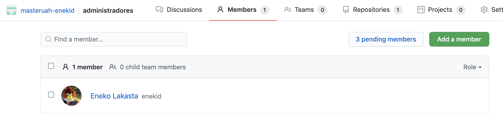
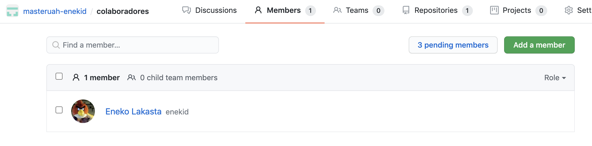
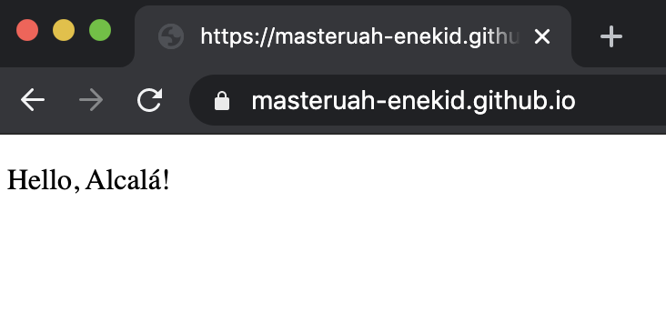

## Básico

En el trabajo uso git a diario, así que algunos de los puntos no los puedo realizar de nuevo (_instalar git_, _registro GitHub_ y _ssh_)

Usuario GitHub: [enekid](https://github.com/enekid)

La configuración de usuario y email la realizo en el siguiente ejercicio de manera local.


## Medio. Ejercicios de Git, GitHub y Markdown

### Repositorio masteruah

https://github.com/enekid/masteruah

Creado vacío. No lo clono porque lo iniciaré en local y haré push.

### Init y configuración

```bash
git init
git config user.name "Eneko Lakasta"
git config user.email "enekolakasta@gmail.com"
```

### README.md, commit y push

```bash
git add README.md
git commit -m "commit inicial"
git branch -M main
git remote add origin git@github.com:enekid/masteruah.git
git push -u origin main
```

Nuevos tiempos, usamos `main` en lugar de `master`.

### Ignorar archivos

Editar `.gitignore`

```
privado.txt
privada/
```

### Añadir fichero 1.txt

```bash
git add 1.txt
```

### Crear el tag v0.1

```bash
git tag v0.1
```

### Subir cambios

```bash
git push origin main
git push origin v0.1
```

### Cuenta GitHub


### Crear tabla

| NOMBRE           | GITHUB                       |
| ---------------- | ---------------------------- |
| Andrés Fondevila | https://github.com/andresuah |
| Adolfo Onrubia   | https://github.com/Binomi0   |
| Joseph Reyes     | https://github.com/jossjack  |

## Avanzado. Ejercicios de Git, GitHub y Markdown.

### Crear una rama v0.2

```bash
git checkout -b v0.2
```

### Añadir fichero 2.txt

```bash
touch 2.txt
git add 2.txt
git commit -m'Add 2.txt'
```

### Crear rama remota v0.2

```bash
git push origin v0.2
```

### Merge directo

```bash
git checkout main
git merge v0.2
```

### Merge con conflicto

```bash
echo "Hola" > 1.txt
git add 1.txt
git commit -m'Change 1.txt'

git checkout v0.2
echo "Adios" > 1.txt
git add 1.txt
git commit -m'Change 1.txt again'

git checkout main
git merge v0.2
```

### Listado de ramas

```bash
git branch --merged
git branch --no-merged
```

### Arreglar conflicto

```bash
git add 1.txt
git commit -m'Fix merge 1.txt'
```

### Borrar rama

```bash
git tag v0.2
git branch -d v0.2
git push --tag origin main
```

### Listado de cambios

```bash
git log --oneline --decorate --graph --all
```

### Crear organización y equipos






### Crear index.html

https://masteruah-enekid.github.io/


